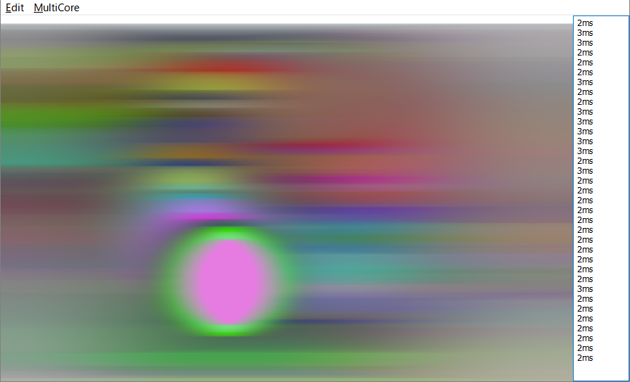

# Multi-core and Multi-threading

Simple multi-core class code.\
簡単なマルチコア処理クラスのコード。\
Create threads and assign it to CPU core.\
スレッドを生成して論理コアに対応づけます。\
It is available in XP or later.\
windowsXPで動作する範囲でのAPIを使用しています。

## Sample

Sample is the test code of the multicore distributed processing.\
サンプルはぼかしをマルチコア処理します。\
\


## Initialize finalize


Please call initialization function before using.\
使用するまえに初期化関数を呼びましょう。\
Usage threads-count is rounded to the number of CPU cores.\
使用スレッド数はCPUのコア数に丸め込まれます。
```delphi
  // initialize
  _MultiCoreInitialize(4);
  corecount := _MultiCoreManager.Count;
  ...
  // finalize
  _MultiCoreFinalization;
```

## Multi-core processing code


Simple distributed code example.\
簡単な分散処理コードは以下になります。
```delphi
  // task add
  for i:=0 to CoreCount-1 do
    _MultiCoreManager.Add(MultiCore_HorizonBlur,@UserRecord[i]);
  // start
  _MultiCoreManager.Start;
  // sync
  _MultiCoreManager.Sync;
```
function-pointer and event(class-method) can be used for tasks.\
タスク登録には関数ポインタとイベント（クラスメソッド）が使用出来ます。

## Data transfer

This example of passing data to a function called by a thread.\
スレッドが呼び出す関数への値の受け渡しには以下のようにポインタを介します。
```delphi
type
  TMultiCoreThreadFunc = procedure(ptr:Pointer);
  TMultiCoreThreadEvent = procedure(ptr:pointer) of object;
```
It is easy to use record.\
構造体を使うのが簡単でしょう。
```delphi
  // multicore processing user record
  for i:=0 to CoreCount-1 do
  begin
    // process index area (do not duplicate area)
    UserRecord[i].startindex := (i * Buffer.Height) div CoreCount;
    UserRecord[i].endindex   := ((i+1) * Buffer.Height) div CoreCount -1;
    // Accumlation buffer (horizon only)
    UserRecord[i].AccumLength := Buffer.Width;
    ...
  end;
```
```delphi
  // task add
  for i:=0 to CoreCount-1 do
    _MultiCoreManager.Add(MultiCore_HorizonBlur,@UserRecord[i]);
```
```delphi
procedure TForm1.MultiCore_HorizonBlur(ptr: pointer);
var
  data : PMultiCoreData;
  sline,eline : integer;
  ...
begin
  // user record pointer
  data := PMultiCoreData(ptr);
  // area
  sline := data.startindex;
  eline := data.endindex;
  ...
end;
```

## Blur algorithm

Blur processing be used "prefix sum" buffer.\
ブラー処理には"prefix sum"したバッファを使用しています。\
左からピクセルのRGBを足してその値を書き込んでいくのが"prefix sum"です。

* prefix sum\
https://en.wikipedia.org/wiki/Prefix_sum

* 2d sum quaries\
https://www.youtube.com/watch?v=hqOqr6vFPp8

* nVIDIA D3D Compute Filter Sample\
https://docs.nvidia.com/gameworks/index.html#gameworkslibrary/graphicssamples/d3d_samples/d3dcomputefiltersample.htm

```
AccumRGB[pos+8] - AccumRGB[pos-8] = RGB[pos-7] + RGB[pos-6] + ... + RGB[pos+8]
```

通常だと暈かしサイズが大きくなるとreadが増えますが、加算したバッファを用意すれば2点間のreadで一律に合計値を求めることが出来ます。\
横縦2Dの暈かしの場合は、横の後に縦も加算しておけば、4点で求められます。\
とはいえ縦方向を含むとコードがかなり複雑になるので、サンプルでは横方向のみしか使用していません。